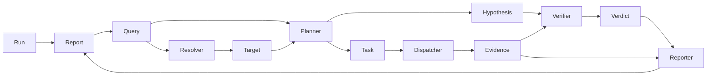

# 架构

本文档记录 aruing 的架构事实，面向开发者、AI 工具和想了解项目的人。只放当前事实，不放设计推理过程。

> 设计推理、备选方案、阶段讨论位于 `arui-note/aruing/` 笔记目录。

## 诊断流程



一次诊断：用户提问 → Parser 提取线索 → Resolver 在集群中确认目标 → Planner 生成猜想和取证任务 → Dispatcher 调工具拿证据 → Verifier 基于证据判断 → Reporter 整理报告。每条结论可回溯到具体 `Evidence` 和工具调用。

## 模块职责

| 包 | 负责 | 不负责 |
| --- | --- | --- |
| `cmd/aruing` | CLI 入口、参数解析、依赖组装（`wiring.go`） | 不承担推理、不查集群 |
| `internal/core` | 领域模型：`Run` / `Query` / `Node` / `Edge` / `Target` / `Hypothesis` / `Task` / `Evidence` / `Verdict` / `Report` / `TimeRange` / `Factory` | 不调外部依赖 |
| `internal/agent` | 推理角色：`Parser` / `Resolver` / `Planner` / `Verifier` / `Reporter` 及 `Orchestrator` 编排 | 不直接查集群、不持久化 |
| `internal/llm` | OpenAI 兼容协议客户端，发 prompt 收 JSON / 文本 | 不感知 prompt 内容与组装 |
| `internal/tools` | `Tool` 接口、`Registry`、`Dispatcher`、`FakeListPodsTool` | 不判断业务、不做推理 |
| `internal/tools/k8s` | 真实 Kubernetes 只读工具（占位，等接入 client-go） | 当前未实现 |
| `internal/tools/prometheus` | 指标查询（占位） | 当前未实现 |
| `internal/tools/loki` | 集中日志（占位） | 当前未实现 |
| `internal/store` | 持久化诊断状态和证据（占位） | 当前未实现 |
| `internal/graph` | 流程编排状态机（占位） | 当前由 `Orchestrator` 承担线性流程 |
| `internal/config` | 集中收敛运行参数（占位） | 当前由 `cmd/aruing/main.go` 直接读 env |
| `internal/api` | HTTP / 网络入口（占位） | 当前仅 CLI |

## 核心数据结构

所有实体通过 `RunID` 扁平关联，子实体不嵌套进 `Run`。编号格式为 `前缀_UUIDv7`，由 `core.Factory` 统一生成。

| 结构 | 字段要点 |
| --- | --- |
| `Run` | `ID / Question / Status / CreatedAt / UpdatedAt`；`SessionID` 预留多轮对话 |
| `Query` | `ID / RunID / Goal / Nodes / Edges / TimeRange`；用户问题的开放图结构 |
| `Node` | `ID / Type / Text / Attrs`；类型开放（如 `resource`、`symptom`），属性用 `k8s.*` / `hint.*` 前缀 |
| `Edge` | `ID / From / To / Type / Attrs`；有向关系，类型开放（如 `calls`、`depends_on`） |
| `Target` | `ID / RunID / NodeID / Type / Attrs / EvidenceIDs`；定位阶段在真实环境中确认的对象 |
| `Hypothesis` | `ID / RunID / Statement / Reason / ExpectedSignals`；待证据验证的候选原因 |
| `Task` | `ID / RunID / Refs / ToolName / Arguments / Purpose / DependsOn`；通用 `Refs` 关联 Node / Target / Hypothesis |
| `Evidence` | `ID / RunID / TaskID / ToolName / CommandView / Summary / Raw / Error`；工具产出的证据 |
| `Verdict` | `ID / RunID / HypothesisID / Result / Reason / EvidenceIDs`；`Result` ∈ {supported, refuted, insufficient} |
| `Report` | `ID / RunID / Title / Summary / Conclusions / Suggestions` |
| `Conclusion` | `HypothesisID / Result / Reason / EvidenceIDs`；`Report` 中的结论条目 |
| `Factory` | `NewID(prefix) / Now()`；统一 ID 和时间生成，可注入确定性依赖 |

## 信任边界

```
Run.Question              用户原始输入，不可信
Query / Node / Edge       未验证线索，不能直接用于诊断
Target                    真实环境确认的对象，可进入诊断
Hypothesis                待验证猜想，不能作为结论
Evidence                  工具实际执行产生的记录，唯一可信事实源
Verdict                   只能基于 Evidence 得出
Report                    对 Verdict 和 Evidence 引用的整理，不编造
```

## 数据关联

实体不嵌套，全部通过 `RunID` 扁平关联：

```
Run ──RunID──→ Query ──NodeID──→ Target
                    │
              ──RunID──→ Hypothesis ──Refs──→ Task ──TaskID──→ Evidence
                              │                                          │
                              └──HypothesisID──→ Verdict ←──EvidenceIDs───┘
                                                       │
                                                 映射为 Conclusion → Report
```

存储层可 `WHERE run_id=?` 一次取出某次运行的全部实体。

## 硬约束

后续开发不得违反（与 `arui-note/aruing/plan/0.0.1-beta1/2026-7-15.md` 一致并增补）：

1. 不恢复 `Scope`，不增加固定 Kubernetes 资源字段
2. 不枚举用户操作、资源类型和关系类型
3. `Query` 线索不能直接当作 `Target`
4. 模型输出不能冒充 `Evidence`
5. `Verdict` 必须引用 `Evidence`
6. `Task` 不增加阶段专用引用字段，只用通用 `Refs`
7. 子实体不嵌套进 `Run`
8. `Orchestrator` 只编排，不承担解析、规划、判断和报告内容生成
9. prompt 必须从外部文件加载，不写死在代码里（`//go:embed` 满足该约束）
10. LLM 输出的节点 / 关系用局部 ref，系统编号由 `core.Factory` 统一回填
11. 多节点不得在 Parser 实现层做 `len==1` 限制，`core.Query.Nodes` / `Edges` 保持切片
12. 工具只读，禁止 `delete / update / patch / exec` 等写操作

与约束冲突时按 `arui-note` 既有"禁止回退"流程处理：未经维护者重新批准不得违反。
