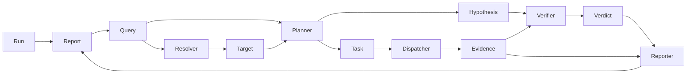

# 架构

本文档记录 aruing 的架构事实，面向开发者、AI 工具和想了解项目的人。只放当前事实，不放设计推理过程。

> 设计推理、备选方案、阶段讨论位于 `arui-note/aruing/` 笔记目录。

## 诊断流程



一次诊断：用户提问 → Parser 提取线索 → Resolver 在集群中确认目标 → Planner 生成猜想和取证任务 → Dispatcher 调工具拿证据 → Verifier 基于证据判断 → Reporter 整理报告。每条结论可回溯到具体 `Evidence` 和工具调用。

**当前编排事实**：`Orchestrator` 按上图**线性、同步**推进，一次 `Execute` 跑完到 `Report`（或失败）。阶段之间仍是直线管道；**定位阶段内部**是编排可见的小循环（`ResolveDriver.Next` → 可选 `Dispatcher.Execute` → 回喂 → `submit_targets` / `fail`），默认最多 8 轮（`SetResolveMaxRounds`）。定位后、调查前编排跑一次**集群侦察**（`reconCluster`，经 `executeTask` 调只读 `kubectl api-resources`）：发现集群资源类型（含 CRD）注入 Planner 的 `cluster_resources`；侦察产出的 Evidence 进报告链（透明可追溯、失败也落 error evidence），但**不进 Verifier 输入**（是 context 而非 verdict 依据）；仅当 wiring 注册了 k8s 工具时启用（`SetReconEnabled`）。这是最小单轮诊断的驱动方式，不是产品终态。用户侧多轮对话、Session、跨阶段挂起，将来通过编排升级（可步进 / 可挂起的状态机，`internal/graph` 占位）实现；领域实体仍按 `RunID` 扁平关联，`Run.SessionID` 预留会话。演进约定见下方硬约束 #15–#17。

## 模块职责

| 包 | 负责 | 不负责 |
| --- | --- | --- |
| `cmd/aruing` | CLI 入口、参数解析、依赖组装（`wiring.go` 吃 `config.Config`：无 LLM 全 fake；有 LLM 时五角色换真实现）；`formatRunError` 对 LLM 类失败附人话提示 | 不承担推理、不查集群、不直接读业务 env |
| `internal/core` | 领域模型：`Run` / `Query` / `Node` / `Edge` / `Target` / `Hypothesis` / `Task` / `Evidence` / `Verdict` / `Report` / `TimeRange` / `Factory` | 不调外部依赖 |
| `internal/agent` | 推理角色：`Parser` / `ResolveDriver`（`LLMResolver` / `FakeResolver`）/ `Planner`（`LLMPlanner` / `FakePlanner`）/ `Verifier`（`LLMVerifier` / `FakeVerifier`）/ `Reporter`（`LLMReporter` / `FakeReporter`）及 `Orchestrator` 编排；Parser、Resolver、Planner、Verifier、Reporter 可接 LLM（prompt `//go:embed`）；规划、验证与报告均为单次调用，工具规格来自 `Registry.Specs` | 不直接查集群、不持久化；不把线性 `Execute→Report` 当成永久对外契约；角色不私自多轮调 Tool |
| `internal/llm` | OpenAI 兼容协议客户端，发 prompt 收 JSON / 文本 | 不感知 prompt 内容与组装 |
| `internal/tools` | `Tool` / `ToolSpec`、`Registry`（含 `Specs`）、`Dispatcher`、`Policy`（`ReadonlyPolicy` / `AllowAll`）、`FakeListPodsTool`；按后端粒度注册，暴露 JSON Schema；执行前经 Policy 授权 | 不判断业务、不做推理、不枚举资源类型 |
| `internal/tools/k8s` | 后端级 `k8s` 工具：shell-less 结构化 argv 调用 kubectl；Evidence 记录 exitCode/stdout/stderr | 不内置读写唯一真相（由 `Policy` 白名单）；主编排 wiring 在 kubectl 可用时可选注册 |
| `internal/tools/prometheus` | 指标查询（占位） | 当前未实现 |
| `internal/tools/loki` | 集中日志（占位） | 当前未实现 |
| `internal/store` | 持久化诊断状态和证据（占位） | 当前未实现 |
| `internal/graph` | 流程编排状态机（占位） | 当前未用；线性流程暂由 `Orchestrator` 承担，多轮升级时承接状态机 |
| `internal/config` | 从 env（`ARUING_*`）加载进程级配置：`LLM`（BaseURL/APIKey/Model）、`Tools.KubectlPath`；`LLM.Ready` / `ToClientConfig` | 不解析配置文件、不热更新、不读 `.env` 文件本身 |
| `internal/api` | HTTP / 网络入口（占位） | 当前仅 CLI |

## 核心数据结构

所有实体通过 `RunID` 扁平关联，子实体不嵌套进 `Run`。编号格式为 `前缀_UUIDv7`，由 `core.Factory` 统一生成。

| 结构 | 字段要点 |
| --- | --- |
| `Run` | `ID / Question / Status / CreatedAt / UpdatedAt`；`SessionID` 预留多轮对话 |
| `Query` | `ID / RunID / Goal / Nodes / Edges / TimeRange`；用户问题的开放图结构 |
| `Node` | `ID / Type / Text / Attrs`；类型开放（如 `resource`、`symptom`），属性用 `k8s.*` / `hint.*` 前缀 |
| `Edge` | `ID / From / To / Type / Attrs`；有向关系，类型开放（如 `calls`、`depends_on`） |
| `Target` | `ID / RunID / NodeID / Type / Attrs / EvidenceIDs`；定位阶段在真实环境中确认的对象 |
| `Hypothesis` | `ID / RunID / Statement / Reason / ExpectedSignals`；待证据验证的候选原因 |
| `Task` | `ID / RunID / Refs / ToolName / Arguments / Purpose / DependsOn`；通用 `Refs` 关联 Node / Target / Hypothesis |
| `Evidence` | `ID / RunID / TaskID / Source / ToolName / CommandView / Summary / Raw / Error`；工具产出的证据 |
| `ToolSpec` | `Name / Description / InputSchema`；注册表可发现的工具元数据，`InputSchema` 为 JSON Schema |
| `Verdict` | `ID / RunID / HypothesisID / Result / Reason / EvidenceIDs`；`Result` ∈ {supported, refuted, insufficient} |
| `Report` | `ID / RunID / Title / Summary / Conclusions / Suggestions` |
| `Conclusion` | `HypothesisID / Result / Reason / EvidenceIDs`；`Report` 中的结论条目 |
| `Factory` | `NewID(prefix) / Now()`；统一 ID 和时间生成，可注入确定性依赖 |

## 信任边界

```
Run.Question              用户原始输入，不可信
Query / Node / Edge       未验证线索，不能直接用于诊断
Target                    真实环境确认的对象，可进入诊断
Hypothesis                待验证猜想，不能作为结论
Evidence                  工具实际执行产生的记录，唯一可信事实源
Verdict                   只能基于 Evidence 得出
Report                    对 Verdict 和 Evidence 引用的整理，不编造
```

## 数据关联

实体不嵌套，全部通过 `RunID` 扁平关联：

```
Run ──RunID──→ Query ──NodeID──→ Target
                    │
              ──RunID──→ Hypothesis ──Refs──→ Task ──TaskID──→ Evidence
                              │                                          │
                              └──HypothesisID──→ Verdict ←──EvidenceIDs───┘
                                                       │
                                                 映射为 Conclusion → Report
```

存储层可 `WHERE run_id=?` 一次取出某次运行的全部实体。

## 硬约束

后续开发不得违反（与 `arui-note/aruing/plan/0.0.1-beta1/2026-7-15.md` 一致并增补）：

1. 不恢复 `Scope`，不增加固定 Kubernetes 资源字段
2. 不枚举用户操作、资源类型和关系类型
3. `Query` 线索不能直接当作 `Target`
4. 模型输出不能冒充 `Evidence`
5. `Verdict` 必须引用 `Evidence`
6. `Task` 不增加阶段专用引用字段，只用通用 `Refs`
7. 子实体不嵌套进 `Run`
8. `Orchestrator` 只编排，不承担解析、规划、判断和报告内容生成
9. prompt 必须从外部文件加载，不写死在代码里（`//go:embed` 满足该约束）
10. LLM 输出的节点 / 关系 / 猜想 / 规划任务用局部 ref，系统编号由 `core.Factory` 统一回填（Parser 回填 Query/Node/Edge；Planner 回填 Hypothesis/Task；Verifier 回填 Verdict，且 Verdict 只能引用已登记 Evidence；Reporter 回填 Report，结论对齐 Verdict 且证据引用不得越界）
11. 多节点不得在 Parser 实现层做 `len==1` 限制，`core.Query.Nodes` / `Edges` 保持切片
12. 工具接口不限定读写；授权由 `Policy` 在 `Dispatcher.Execute` 前决定（当前默认只读 argv 白名单 Deny 写操作）；后续"辅助修复"可扩展 `RequireApproval` 与写工具
13. 工具按后端粒度注册，通过 `ToolSpec.InputSchema`（JSON Schema）声明参数；不得在接口层按资源类型或子命令拆成多个工具
14. 后端工具调用不得经 shell；`k8s` 使用结构化 argv + `exec` 直调 kubectl，由部署侧配置二进制路径
15. 当前线性 `Orchestrator` 是最小单轮诊断的**临时驱动器**，不是永久骨架；允许在单轮阶段保留，但不得将其固化为对外长期 API、唯一持久化入口或全项目默认契约
16. 角色不得在编排层不可见的情况下私自多轮调用工具；Tool 只经 Registry / Dispatcher（及后续统一执行环 / Policy）进入 `Evidence` 链；领域编号与创建时间必须经 `core.Factory` 发放，角色与工具不得私自编造身份。定位阶段：`ResolveDriver` 只返回 `call_tool` / `submit_targets` / `fail` 意图；编排执行工具、写 `Evidence`、在 `submit` 时发放 `Target.ID`（定位用 `Task`/`Evidence` ID 亦由编排发放）。规划阶段：`LLMPlanner` 单次 `Plan`，不调 Tool；`Hypothesis`/`Task` ID 与 `CreatedAt` 由规划器经 `Factory` 回填。验证阶段：`LLMVerifier` 单次 `Verify`，不调 Tool；`Verdict` ID 与 `CreatedAt` 由验证器经 `Factory` 回填，且 `evidence_ids` 必须全部属于输入 Evidence。报告阶段：`LLMReporter` 单次 `Report`，不调 Tool；`Report` ID 与 `CreatedAt` 由报告器经 `Factory` 回填；结论覆盖每条 Verdict 且 `result` 与之一致，`evidence_ids` 必须属于对应 Verdict 的证据集
17. 多轮升级（系统内连查、用户澄清、Session 对话）以编排改造为主，须保留扁平 `RunID` 关联、`Task`/`Evidence` 形态与工具协议；不得为此恢复嵌套 `Run` 或另起与 Dispatcher 平行的执行通道

与约束冲突时按 `arui-note` 既有"禁止回退"流程处理：未经维护者重新批准不得违反。
