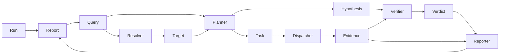

# 架构

本文档记录 aruing 的架构事实，面向开发者、AI 工具和想了解项目的人。只放当前事实，不放设计推理过程。

> 设计推理、备选方案、阶段讨论位于 `arui-note/aruing/` 笔记目录。

## 诊断流程



一次诊断：用户提问 → Parser 提取线索 → Resolver 在集群中确认目标 → Planner 生成猜想和取证任务 → Dispatcher 调工具拿证据 → Verifier 基于证据判断 → Reporter 整理报告。每条结论可回溯到具体 `Evidence` 和工具调用。

**当前编排事实**：`Orchestrator.Execute` 返回 `core.Outcome`（`Report` 完成或 `Suspension` 挂起）。线性、同步推进到 `Report`（或失败或挂起）。阶段之间仍是直线管道；**定位阶段内部**是编排可见的小循环（`ResolveDriver.Next` → 可选 `Dispatcher.Execute` → 回喂 → `submit_targets` / `clarify` / `fail`），默认最多 8 轮（`SetResolveMaxRounds`）。定位驱动可产第 4 意图 `clarify`：多义匹配且无法工具消歧时向用户提问，编排将 Run 挂起（`RunStatusWaitingUser`）并返回 `Suspension`；用户在同一会话回复后 `Orchestrator.Resume` 注入 `Clarifications` 并自定位阶段重跑（非 checkpoint，保留已取证据）。调查阶段同样可挂起：规划器在 `Plan.Clarify` 提议澄清（证据不足以继续且缺口信息用户知道；与任务/猜想互斥，同给为规划错误），`investigateLoop` 累积状态外提为 `InvestigateState` 种子（镜像定位循环），挂起快照带 `Stage=investigate`，`Resume` 按阶段派发：调查路径**保留调查进度（猜想/任务/证据/判决）续跑**、仅重置轮次预算、不重复解析与侦察。**调查阶段取证决策双路径**（config `agent.acquire.method`，空 = ours 产品默认；`b1-serial` = 旧循环零改动保真基线口径；`b2-random` / `b4-cheapest` = 实验臂，复用 ours 决策循环全部机制只换选择策略——种子随机 / 恒选最低成本，对照口径「其余一切同构」）：决策循环路径（ours 及实验臂）走 `acquireLoop`——每轮选一个动作（ours 为 `a* ← argmax EIG(a)/c(a)`；工具动作映射 Task 经 Dispatcher 执行，问用户动作统一建模为高成本动作、选中即复用 investigate clarify 挂起且选项即结果类别），观测经机械归类（证据 Summary 对结果类别唯一命中）优先离散更新、零/多命中走 `JudgeStrength` 富文本强度更新，MSPRT 三出口（supported → 正式 Verify；refuted → abduction 重规划，旧假设保留后验压低；insufficient → 平台/预算尽带缺口）；决策状态（信念/动作池）随 `InvestigateState.Acquire` 进挂起快照，Resume 答复按结果类别归类更新后续跑；LLM 只在决策规划、重规划与强度判定三处出现，算术全在 `internal/agent/acquire` 纯函数包；后验回写 `Hypothesis.Confidence`（Evidence 之上的聚合视图非替代）。挂起快照进程内按 `RunID` 索引（`suspended map` + mutex），退出即丢。定位回喂证据 raw 时：**环内全量**，注入模型侧多条 **共享** raw 预算、优先保新，超预算截断/占位并标记（#18，禁止固定字数墙）。定位后、调查前编排跑一次**集群侦察**（`reconCluster`，经 `executeTask` 调只读 `kubectl api-resources`）：发现集群资源类型（含 CRD）注入 Planner 的 `cluster_resources`；侦察产出的 Evidence 进报告链（透明可追溯、失败也落 error evidence），但**不进 Verifier 输入**（是 context 而非 verdict 依据）；仅当 wiring 注册了 k8s 工具时启用（`SetReconEnabled`）。这是最小单轮诊断的驱动方式，不是产品终态。

**用户侧会话（Session + Tower）**：`internal/session` 提供 `Service.Turn`：确认会话 → 读历史 → 落 user 消息 → `Responder.Respond` →（可选）落 `ModeCheckpoint` 消息 → 落 assistant 消息 → 刷新 `Session.UpdatedAt`。产品路径 `agent.TowerResponder`：**Respond 入口先 type-assert `SuspendedRunner`，会话有挂起 Run 时优先 `session.Resume`（用户原文作澄清答复），不走 LLM 动作决策**；无挂起时进入 LLM 有限动作 **reply**（基线自然语言）/ **call_tool**（经同一 `Dispatcher`，`Task.RunID` 空，轮内回喂含 **Evidence.Raw**，默认最多 12 次防死环，观察不落 Message；注入时多观察 **共享** raw 预算、优先保新，超预算带 truncated 标记；**tool 轮次触顶则自动 escalate**，禁止对用户报内部预算用尽）/ **escalate**（`session.Escalate` → `Orchestrator.Execute`，写入 `Run.SessionID`；**完成时将 `Report` + `[]Evidence` 写入进程内 `RunLedger`**，权威源不是 Message 摘要；**挂起时返 `ModeClarify` + 澄清问题，不写账本**）。`session.Resume`（注入答复 → `SuspendedRunner.Resume` → 完成落账本或再挂起）与 `Escalate` 共用 `outcomeToRespond`。`SuspendedRunner` 为可选接口（`Resume` / `FindSuspended`），测试双只实现 `RunExecutor` 仍编译。**深解注入（方案 A）**：每个 Turn 入口 `ListBySession` 取本会话正式诊断，注入 user payload 的 `prior_run_details`（结论、证据 id/summary/commandView，证据 `raw` 多 run **共享**预算、优先保新，#18）；`prior_diagnostics` 仍为 Message 侧摘要；解释既有诊断默认 **reply**、不 re-escalate。**基线轻量环境可见性**：每个 Turn 入口在 k8s 已注册时最多一次只读 `api-resources`（空 `RunID`、经 Dispatcher），解析后注入决策 payload 的 `cluster_resources`（与 Planner 同源 `parseAPIResources`）；失败降级为空列表，不挡 reply；**不**作 Verdict 证据、**不**新建正式 Run。**注入模型的历史**：Store 全量保留；预算内尽量全文；超预算 `prepareTowerContext` 做 L0（长消息截断预览）→ L1（折叠旧非诊断）→ L2（LLM handoff 摘要 + 近期原文，产出 `CheckpointContent` 由 Turn 落库）。禁止 last-N 静默截肢（#18）。**压缩后按范围回灌**：默认视图因 compact 丢细节时，`locateRange`（规则优先 runId/关键词、LLM 兜底）定位相关消息区间 → `rehydrateRange` 从 Store 取原文 → `compactRange`（复用 L0/L1）压进子预算 → 作为 `rehydrated_messages` 注入 payload；步骤级细节据此作答，不编造。回灌原文是对话叙述，非 Evidence/Verdict。空 RunID 的观察不得作为 Verdict 证据。另有 `Echo` / `Diagnose` / `FakeTower` 等供测（在 `agenttest` 等测试包，产品 CLI 不装配）。**CLI**：`aruing chat` → `Session.Turn` + Tower（须 LLM；进程内 `MemoryStore` + `MemoryRunLedger`；`--session` 续聊；经 Tower 自动支持挂起/恢复）；`aruing run` 直连 `Orchestrator.Execute`（**同样须 LLM**，无假闭环回退；**遇 `Suspension` 打印澄清问题到 stderr 并非零退出**，单次无交互环）。配置经 `config.LoadResolved`（可选 YAML + env 覆盖）。Tower 与 Orchestrator **共用同一 Dispatcher**。Message 不嵌证据链；正式诊断 `Report`/`Evidence` 由 `RunLedger` 按 `RunID` 索引（进程内，退出即丢）。领域实体仍按 `RunID` 扁平关联。阶段内挂起（resolve / investigate clarify）已由 `Orchestrator` 按 `Suspension.Stage` 派发承接；跨阶段状态机仍可由 `internal/graph`（占位）承接。演进约定见下方硬约束 #15–#18。

## 模块职责

| 包                          | 负责                                                                                                                                                                                                                                                                                                                                                                                                                                                                                                                                                                                                                                                                                                                                                                                                                                                                                                                                                                                                | 不负责                                                                                                                                                                            |
| --------------------------- | --------------------------------------------------------------------------------------------------------------------------------------------------------------------------------------------------------------------------------------------------------------------------------------------------------------------------------------------------------------------------------------------------------------------------------------------------------------------------------------------------------------------------------------------------------------------------------------------------------------------------------------------------------------------------------------------------------------------------------------------------------------------------------------------------------------------------------------------------------------------------------------------------------------------------------------------------------------------------------------------------- | --------------------------------------------------------------------------------------------------------------------------------------------------------------------------------- |
| `cmd/aruing`                | CLI 入口、参数解析、依赖组装（`wiring.go`：`LoadResolved` 得 `Config`；`buildTooling` 共用 Dispatcher；`newOrchestrator` / `newSessionStack`；**`run`/`chat` 均须 LLM 齐全**，无 CLI 假闭环；`chat` + Tower + MemoryStore + MemoryRunLedger）；`--config`；启动 stderr 打 config path / model banner；`formatRunError` 对 LLM 类失败附人话提示；**版本注入**（`version/commit/date` 经 `-ldflags -X`，源码默认 dev）；**`run --eval-json`**（评测记录落盘：成功 / 挂起 / 失败三路径全记）；**`judge`**（判分子命令：记录 × 场景 ground_truth → ①②层 JSON / ③层抽样 rubric）；**`bench`**（机械判分遍历子命令：矩阵 YAML 或内置默认矩阵 → CSV + 矩阵快照；零 LLM 零集群）；**`connect`**（LLM 三件套交互向导：隐藏输入 / 连通测试失败不落盘 / `SaveLLM` 原子写用户级配置）；**`update`**（自更新：stable 直链 302 取 tag → 版本方向防降级 → checksums 校验 → 内存解包 → `minio/selfupdate` 原子替换；npm 来源（node_modules）拒绝自替换）                                                                                                                                                                                                                                                                                                                | 不承担推理、不查集群、不直接读业务 env                                                                                                                                            |
| `internal/core`             | 领域模型：`Run` / `Query` / `Node` / `Edge` / `Target` / `Hypothesis` / `Task` / `Evidence` / `Verdict` / `Report` / `TimeRange` / `Factory` / `Suspension` / `Outcome`                                                                                                                                                                                                                                                                                                                                                                                                                                                                                                                                                                                                                                                                                                                                                                                                                             | 不调外部依赖                                                                                                                                                                      |
| `internal/agent`            | 推理角色：`Parser` / `ResolveDriver`（`LLMResolver` / `FakeResolver`）/ `Planner`（`LLMPlanner` / `FakePlanner`）/ `Verifier`（`LLMVerifier` / `FakeVerifier`）/ `Reporter`（`LLMReporter` / `FakeReporter`）及 `Orchestrator` 编排（`Execute` 返 `Outcome`；`Resume` + `FindSuspended` 实现 `session.SuspendedRunner`；`LastRunStats` 只读观测统计供评测记录）；**`TowerResponder` / `FakeTowerResponder`** 实现 `session.Responder`（reply / call_tool / escalate；基线 tool 环在 `Respond` 内编排可见；**会话有挂起时入口优先 Resume**；可选注入 `ObservationIndex`：基线成功观察经 Factory 发 `evidenceId` 并 Put，轮末 Discard，供同轮 `evidence.read`）；**`prepareTowerContext`**（L0/L1/L2，prompt `compact.md`）组装注入模型的历史视图；**`buildPriorRunDetails`** 从 `RunLedger` 组装 `prior_run_details`；**`locateRange`/`rehydrateRange`/`compactRange`**（prompt `locate.md`）压缩后按范围回灌原文为 `rehydrated_messages`；角色可接 LLM（prompt `//go:embed`）；规划、验证与报告均为单次调用，工具规格来自 `Registry.Specs`；**决策规划与强度判定输出**（`LLMDecisionPlanner.PlanDecision` 产出带先验假设 + 动作提议 + 判别矩阵的 `PlanDecision`（非法动作丢弃并计数）；`LLMVerifier.JudgeStrength` 对单条证据逐假设产出 (d,s) 强度判定；prompt `planner-decision.md` / `strength.md`；供取证决策循环消费） | 不直接查集群、不持久化；不写 Message（checkpoint 正文由 Tower 产出，`Turn` 落库）；不把线性 `Execute→Report` 当成永久对外契约；角色不私自多轮调 Tool（Tower 工具只经 Dispatcher） |
| `internal/eval`             | 评测基建（纯函数）：参数化大表生成器（固定种子可复现）、run 记录 schema（--eval-json 落盘格式；含取证决策分组与出口观测量：acquire_method / 名义 K / 种子 / 出口与缺口）、判分器（①根因命中机械包含 ②引用合法 ③抽样 rubric；结果透传方法/K/实测轮数供分组）、投影命中判定、bench 遍历（矩阵 N×预算×根因位置×种子×方法 → 逐单元生成/渲染/判分 → CSV）与随机选行消融臂（RandomPick，种子驱动）                                                                                                                                                                                                                                                                                                                                                                                                                                                                                                                                                                                                                                                                                                                                                                                                                                                                                             | 不调集群、不调模型、不做语义判断；不进诊断运行时路径（仅 CLI 评测侧消费）                                       |
| `internal/llm`              | OpenAI 兼容协议客户端，发 prompt 收 JSON / 文本；按调用方标签聚合 token 用量（`Request.Label` + `NewLabelingClient` 装饰 + `UsageTracker` 可选接口，评测记录消费）                                                                                                                                                                                                                                                                                                                                                                                                                                                                                                                                                                                                                                                                                                                                                                                                                                                                                                                                                     | 不感知 prompt 内容与组装                                                                                                                                                          |
| `internal/agent/acquire`   | 主动取证决策的机械计算内核（纯函数，零外部依赖）：对数域贝叶斯信念更新（log-sum-exp；离散判别矩阵与富文本强度两路，强度伪似然 ℓ = 2^(α·d·s) 对数线性恒正）、期望信息增益 EIG（bit）与成本归一动作选择 argmax EIG/c、MSPRT 三出口（supported+置信度 / refuted（假设空间保留质量坍缩）/ insufficient+缺口）、全局意外与信息平台检测；循环状态由编排持有（#16）                                                                                                                                                                                                                                                                                                                                                                                                                                                                                                                                                                                                                                  | 不调工具、不调模型、不 import core/llm（假设对齐与 JSON 解析归接线层）；不做语义判断（LLM 提供判别矩阵与 (d,s) 素材，本包只做算术，#8/#19 同构） |
| `internal/tools`            | `Tool` / `ToolSpec`、`Registry`（含 `Specs`）、`Dispatcher`、`Policy`（`ReadonlyPolicy` / `DiagnosticPolicy` / `AllowAll`）、可选 `Slicer`（`Slice`/`SliceQuery`/`SliceView`，`SliceQuery` 含可选时间窗 `Since`/`Until`，RFC3339 闭区间，后端先过滤再开窗）、轮内 `ObservationIndex`、`evidence.read` 导航工具、`FakeListPodsTool`；按后端粒度注册，暴露 JSON Schema；执行前经 Policy 授权                                                                                                                                                                                                                                                                                                                                                                                                                                                                                                                                                                                                          | 不判断业务、不做推理、不枚举资源类型；不解析各后端 stdout 格式（归后端包）                                                                                                        |
| `internal/tools/summary`    | 工具无关表格投影/导航：大表 Render（列频次 + PCA 异常段 + 取值覆盖）、加权贪心代表性投影（覆盖 + T² 目标，头尾锚预置，基数折算 lazy greedy/CELF；knapsack 对照变体）、方法开关（fast/greedy/greedy-knapsack/full/head-tail/uniform/llm-rerank，rune 预算，同一二进制切对比方法；llm-rerank 为 C4 对照臂，重排器经 `RerankFunc` 回调由装配层注入，默认不装配）、simplestat 消融臂（`RenderOptions.SimpleStat`，异常分用行长 |z| + 非常规取值计数，bench 注入不进 config）、`RenderWithStats`（渲染 + 实例行数/字符观测量）、`SliceRows` 行级 offset/limit                                                                                                                                                                                                                                                                                                                                                                                                                                                                                                                                                                                                                                                                                                                                        | 不调后端、不解析 kubectl/JSON 专属格式、不做业务判断                                                                                                                              |
| `internal/tools/k8s`        | 后端级 `k8s` 工具：shell-less 结构化 argv 调用 kubectl；解析 stdout 为表后调 `summary` 投影；实现 `Slicer`（表格按行/列切片，describe/logs/events 等非表格输出行级兜底切片，Columns 为空；带时间窗时对行首 RFC3339（`logs --timestamps` 产物）机械过滤再开窗，无时间戳或表格遇时间窗明确报错引导）；Evidence 记录 exitCode/stdout/stderr；`MaxStdoutBytes` 可配；`NewReranker`（C4 对照臂的 LLM 重排器构造，prompt `prompts/rerank.md` go:embed；仅 method=llm-rerank 时由装配层构造注入）                                                                                                                                                                                                                                                                                                                                                                                                                                                                                                                                                                                                                                     | 不内置读写唯一真相（由 `Policy` 白名单）；主编排 wiring 在 kubectl 可用时可选注册                                                                                                 |
| `internal/tools/prometheus` | 指标查询（占位）                                                                                                                                                                                                                                                                                                                                                                                                                                                                                                                                                                                                                                                                                                                                                                                                                                                                                                                                                                                    | 当前未实现                                                                                                                                                                        |
| `internal/tools/loki`       | 集中日志（占位）                                                                                                                                                                                                                                                                                                                                                                                                                                                                                                                                                                                                                                                                                                                                                                                                                                                                                                                                                                                    | 当前未实现                                                                                                                                                                        |
| `internal/session`          | 用户侧多轮壳：`Session` / `Message`、`Store`、`RunLedger` / `DiagnosticRecord`、`Service.Turn`、`Responder`（`RespondOutput.CheckpointContent` 可选）、`RunExecutor`（返 `Outcome`）、可选 `SuspendedRunner`（`Resume` / `FindSuspended`）、`Escalate`（建 Run + Execute，完成写 `RunLedger`，挂起返 `ModeClarify`）、`Resume`（注入答复恢复挂起 Run）；脚手架 Echo / Diagnose；Turn 在 assistant 前写入 `ModeCheckpoint`                                                                                                                                                                                                                                                                                                                                                                                                                                                                                                                                                                           | Message 不嵌证据链、不替代 Orchestrator；不实现 LLM Tower / L2 摘要（在 agent）；CLI 经 `aruing chat` 接入                                                                        |
| `internal/tui`              | 终端交互层：**默认行内 inline**（自写 readline + 留痕输出 + 底部输入框 + 多行 + raw mode）；app（bubbletea 全屏）可选待 Step 3 接 `config.TUI.Mode`；共用 glamour Markdown + 主题样式；纯展示层，事实来自 `session.Turn`（守 #20）；streaming buffer 为流式留位；样式经主题（`config.TUI.Theme` dark/light/auto + `config.TUI.ThemeFile` YAML 覆盖：写明才加载、基于内置基底部分覆盖、颜色/边框/内边距、块间距（margin 解析为各块空行数，仅 user/assistant/divider 消费）与称呼开关可调；labels 默认关，开启后称呼独立一行 + 换行 + 内容，默认消息无称呼前缀）                                                                                                                                                                                                                                                                                                                                                                                                                                      | 不持有业务事实、不假装 Evidence/Verdict；不做流式（arc《流式响应》）；不接诊断 core/编排                                                                                          |
| `internal/store`            | 持久化实现：`MemoryStore`（会话与消息）、`MemoryRunLedger`（正式诊断 Report+Evidence）；接口由使用方定义（`session.Store` / `session.RunLedger`）                                                                                                                                                                                                                                                                                                                                                                                                                                                                                                                                                                                                                                                                                                                                                                                                                                                   | 不定义业务接口；进程退出即丢；非磁盘持久化                                                                                                                                        |
| `internal/graph`            | 流程编排状态机（占位）                                                                                                                                                                                                                                                                                                                                                                                                                                                                                                                                                                                                                                                                                                                                                                                                                                                                                                                                                                              | 当前未用；线性诊断仍由 `Orchestrator`；跨阶段挂起时再承接                                                                                                                         |
| `internal/config`           | 进程级配置：可选 YAML（`LoadFile` / `ResolveConfigPath` / `LoadResolved`）+ env（`ARUING_*`）覆盖 + CLI 再盖（如 `--verbose`）；字段含 `LLM`（BaseURL/APIKey/Model）、`Tools`（KubectlPath / AllowDiagnosticExec / MaxStdoutBytes / MaxStderrBytes / Projection：method+budget+lambda+uniform_weight，ARUING_TOOLS_PROJECTION_*，未知 method 启动报错）、`Agent`（Acquire：method（ours | b1-serial | b2-random | b4-cheapest 实验臂，空 = ours）+ max_rounds（轮数预算，0 = 默认 3）+ seed（b2-random 复现种子，其余方法不读）+ alpha/p_star/a/tau/delta/mass_floor 全可选默认，ARUING_AGENT_ACQUIRE_*，未知 method 启动报错；数值非法由 acquire 包消费侧归一）、`TUI`（Mode / Theme / ThemeFile）、`Debug`；`ValidateLLM` / `LLM.Ready` / `ToClientConfig`；**`UserConfigPath` / `SaveLLM`**（connect 落盘：临时文件 0600 + rename 原子替换，未知顶层段保留，仅覆盖 llm 段）；路径链：`--config` → `ARUING_CONFIG` → `playground/config.yaml` → 用户级 → 系统级                                                                                                                                                                                                                                                                                                                                                                                                                                               | 不热更新、不读 `.env` 文件本身（Make 可 inject env）；不 deep-merge 多文件                                                                                                        |
| `internal/api`              | HTTP / 网络入口（占位）                                                                                                                                                                                                                                                                                                                                                                                                                                                                                                                                                                                                                                                                                                                                                                                                                                                                                                                                                                             | 当前仅 CLI                                                                                                                                                                        |

## 核心数据结构

所有实体通过 `RunID` 扁平关联，子实体不嵌套进 `Run`。编号格式为 `前缀_UUIDv7`，由 `core.Factory` 统一生成。

| 结构                               | 字段要点                                                                                                                                                                                                                 |
| ---------------------------------- | ------------------------------------------------------------------------------------------------------------------------------------------------------------------------------------------------------------------------ |
| `Run`                              | `ID / Question / Status / CreatedAt / UpdatedAt`；`SessionID` 在 Diagnose 升格路径写入所属会话；`Status` 含 `waiting_user`（挂起等用户澄清）                                                                             |
| `Session`（`session` 包）          | `ID / CreatedAt / UpdatedAt`；对话容器，不嵌装消息列表                                                                                                                                                                   |
| `Message`（`session` 包）          | `ID / SessionID / Role / Content / CreatedAt`；助手可选 `RunID` / `Mode`（`baseline` / `diagnostic` / `clarify` / `checkpoint`）；`checkpoint` = L2 handoff 摘要，Store 仍保留压缩前全量历史；`clarify` = 诊断挂起问用户 |
| `DiagnosticRecord`（`session` 包） | `RunID / SessionID / Question / Report / Evidence`；一次正式诊断在进程内的可追溯记录；权威源 ≠ Message 摘要                                                                                                              |
| `RunLedger`（`session` 包接口）    | `Put` / `Get` / `ListBySession`；成功 escalate 后可按 `RunID` 读回；不按条数淘汰（#18）；实现见 `store.MemoryRunLedger`                                                                                                  |
| `Query`                            | `ID / RunID / Goal / Nodes / Edges / TimeRange`；用户问题的开放图结构                                                                                                                                                    |
| `Node`                             | `ID / Type / Text / Attrs`；类型开放（如 `resource`、`symptom`），属性用 `k8s.*` / `hint.*` 前缀                                                                                                                         |
| `Edge`                             | `ID / From / To / Type / Attrs`；有向关系，类型开放（如 `calls`、`depends_on`）                                                                                                                                          |
| `Target`                           | `ID / RunID / NodeID / Type / Attrs / EvidenceIDs`；定位阶段在真实环境中确认的对象                                                                                                                                       |
| `Hypothesis`                       | `ID / RunID / Statement / Reason / ExpectedSignals / Confidence`；待证据验证的候选原因；`Confidence` ∈ [0,1]，语义随写入方界定（决策规划写先验，取证决策循环写后验，是 Evidence 之上的聚合视图非替代），零值表示写入方未给可信度                                                                                                                                                |
| `Task`                             | `ID / RunID / Refs / ToolName / Arguments / Purpose / DependsOn`；通用 `Refs` 关联 Node / Target / Hypothesis；**`RunID` 在基线 tool 环可空**，正式诊断必填                                                              |
| `Evidence`                         | `ID / RunID / TaskID / Source / ToolName / CommandView / Summary / Raw / Error`；工具产出的证据；**`RunID` 可空 = 非诊断观察，不得进 Verdict**                                                                           |
| `ToolSpec`                         | `Name / Description / InputSchema`；注册表可发现的工具元数据，`InputSchema` 为 JSON Schema                                                                                                                               |
| `Verdict`                          | `ID / RunID / HypothesisID / Result / Reason / EvidenceIDs`；`Result` ∈ {supported, refuted, insufficient}                                                                                                               |
| `Report`                           | `ID / RunID / Title / Summary / Conclusions / Suggestions`                                                                                                                                                               |
| `Conclusion`                       | `HypothesisID / Result / Reason / EvidenceIDs`；`Report` 中的结论条目                                                                                                                                                    |
| `Factory`                          | `NewID(prefix) / Now()`；统一 ID 和时间生成，可注入确定性依赖                                                                                                                                                            |
| `Suspension`                       | `RunID / SessionID / Stage / Question / Options`；编排某阶段需用户澄清时产出；`Stage` 标明阶段（`resolve` / `investigate`），`Resume` 据此派发                                                                           |
| `Outcome`                          | `Report *Report / Evidence []Evidence / Suspension *Suspension`；编排一次执行的结果；`Report` 与 `Suspension` 恰一非空                                                                                                   |

## 信任边界

```
Run.Question              用户原始输入，不可信
Query / Node / Edge       未验证线索，不能直接用于诊断
Target                    真实环境确认的对象，可进入诊断
Hypothesis                待验证猜想，不能作为结论
Evidence                  工具实际执行产生的记录，唯一可信事实源
Verdict                   只能基于 Evidence 得出
Report                    对 Verdict 和 Evidence 引用的整理，不编造
```

## 数据关联

诊断实体不嵌套，全部通过 `RunID` 扁平关联；会话与消息通过 `SessionID` 关联，助手消息可选挂 `RunID` 指向某次正式诊断：

```
Session ──SessionID──→ Message（可选 RunID）
                              │
Run ←──SessionID（升格时）────┘
 │
 ├──RunID──→ Query ──NodeID──→ Target
 │               │
 │         ──RunID──→ Hypothesis ──Refs──→ Task ──TaskID──→ Evidence
 │                         │                                          │
 │                         └──HypothesisID──→ Verdict ←──EvidenceIDs───┘
 │                                                  │
 │                                            映射为 Conclusion → Report
 │
 └──RunID──→ RunLedger.DiagnosticRecord（Report + Evidence 拷贝；进程内）
```

会话消息可 `WHERE session_id=?` 按序取出；正式诊断产物可按 `RunID` 从 `RunLedger` 读回（当前内存实现）。

## 硬约束

后续开发不得违反（与 `arui-note/aruing/plan/0.0.1-beta1/2026-7-15.md` 一致并增补）：

1. 不恢复 `Scope`，不增加固定 Kubernetes 资源字段
2. 不枚举用户操作、资源类型和关系类型
3. `Query` 线索不能直接当作 `Target`
4. 模型输出不能冒充 `Evidence`
5. `Verdict` 必须引用 `Evidence`
6. `Task` 不增加阶段专用引用字段，只用通用 `Refs`
7. 子实体不嵌套进 `Run`
8. `Orchestrator` 只编排，不承担解析、规划、判断和报告内容生成
9. prompt 必须从外部文件加载，不写死在代码里（`//go:embed` 满足该约束）
10. LLM 输出的节点 / 关系 / 猜想 / 规划任务用局部 ref，系统编号由 `core.Factory` 统一回填（Parser 回填 Query/Node/Edge；Planner 回填 Hypothesis/Task；Verifier 回填 Verdict，且 Verdict 只能引用已登记 Evidence；Reporter 回填 Report，结论对齐 Verdict 且证据引用不得越界）
11. 多节点不得在 Parser 实现层做 `len==1` 限制，`core.Query.Nodes` / `Edges` 保持切片
12. 工具接口不限定读写；授权由 `Policy` 在 `Dispatcher.Execute` 前决定（当前默认只读 argv 白名单 Deny 写操作）；后续"辅助修复"可扩展 `RequireApproval` 与写工具
13. 工具按后端粒度注册，通过 `ToolSpec.InputSchema`（JSON Schema）声明参数；不得在接口层按资源类型或子命令拆成多个工具
14. 后端工具调用不得经 shell；`k8s` 使用结构化 argv + `exec` 直调 kubectl，由部署侧配置二进制路径
15. 当前线性 `Orchestrator` 是最小单轮诊断的**临时驱动器**，不是永久骨架；允许在单轮阶段保留，但不得将其固化为对外长期 API、唯一持久化入口或全项目默认契约
16. 角色不得在编排层不可见的情况下私自多轮调用工具；Tool 只经 Registry / Dispatcher（及后续统一执行环 / Policy）进入 `Evidence` 链；领域编号与创建时间必须经 `core.Factory` 发放，角色与工具不得私自编造身份。定位阶段：`ResolveDriver` 只返回 `call_tool` / `submit_targets` / `clarify` / `fail` 意图；编排执行工具、写 `Evidence`、在 `submit` 时发放 `Target.ID`（定位用 `Task`/`Evidence` ID 亦由编排发放）；`clarify` 时编排挂起 Run 并返回 `Suspension`，不执行工具。规划阶段：`LLMPlanner` 单次 `Plan`，不调 Tool；`Hypothesis`/`Task` ID 与 `CreatedAt` 由规划器经 `Factory` 回填。验证阶段：`LLMVerifier` 单次 `Verify`，不调 Tool；`Verdict` ID 与 `CreatedAt` 由验证器经 `Factory` 回填，且 `evidence_ids` 必须全部属于输入 Evidence。报告阶段：`LLMReporter` 单次 `Report`，不调 Tool；`Report` ID 与 `CreatedAt` 由报告器经 `Factory` 回填；结论覆盖每条 Verdict 且 `result` 与之一致，`evidence_ids` 必须属于对应 Verdict 的证据集
17. 多轮升级（系统内连查、用户澄清、Session 对话）以编排改造为主，须保留扁平 `RunID` 关联、`Task`/`Evidence` 形态与工具协议；不得为此恢复嵌套 `Run` 或另起与 Dispatcher 平行的执行通道
18. **不得用人为上限阉割正常产品能力**（与 #2 同构，不限于「枚举」）：禁止把「最近 N 条历史」「最多 K 次诊断摘要」「只支持封闭意图表」等实现成默认能力边界，导致用户正常续聊 / 追问 / 使用时静默丢信息或被迫新开会话。权威数据（如 `Store` 消息）须可全量保留；注入模型等受物理预算约束的路径须 **预算内尽量全给，超预算用压缩 / 剪枝 / 分页 / 明确失败与可恢复路径**（如 context compaction），不得用固定条数 / 步数截肢冒充最小闭环。仍允许：有限 **系统动作**（非用户意图枚举）、**授权与安全 Policy**、单次调用防死环的熔断（触顶须明确失败且可调，不得变成会话记忆或业务能力的永久墙）
19. **工具输出为可导航双结构，不是字符串**：`Evidence.Raw` 是工具产出的不可变原带（产出后只留存、不回写）；`Summary` 与后续派生视图是投影。工具只做**机械格式投影**（按输出格式解析行/列等结构，**不按资源类型映射、不下健康判断**；判断归模型 + 编排）。模型经 `Summary` 看全貌、按需 narrow 查询或经注册工具 `evidence.read`（`Slicer` + 轮内 `ObservationIndex`，#17）drill 到 `Raw` 行级切片；不得用整块文本或截断预览逼模型猜全貌。分片汇总（map-reduce）类全覆盖扫描作为专门能力存在，不是工具输出默认出口。详见笔记 `plan/arc/tool-output-navigation.md`

20. **终端交互（TUI）是纯展示层**：`aruing chat` 的终端交互（bubbletea 等）只做渲染与输入捕获，所有证据 / 结论来自 `session.Turn` 的 `TurnResult` 与 `RunLedger`，TUI 不得成为第二真相源、不得假装 `Evidence` / `Verdict`（守 #4 / #5）；样式经主题（`tui.theme` 内置基底 + `tui.theme_file` YAML 覆盖），代码不得硬编码颜色 / 边框（为可定制留路）；Model 须预留 streaming buffer 字段、View 渲染对 streaming 友好（为流式响应留位，见笔记 `plan/arc/streaming-response.md`）。详见笔记 `plan/arc/tui.md`

与约束冲突时按 `arui-note` 既有"禁止回退"流程处理：未经维护者重新批准不得违反。
